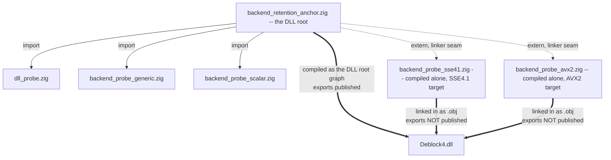
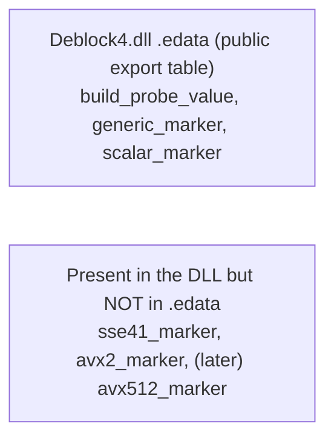

# How Deblock4's CPU-Specific Backend Objects Work

**Version:** 1.1
**Date:** 2026-07-28
**Status:** Informative explainer for maintainers. Not controlling.
The README design spec and the AI charter prevail for any rule.
**Audience:** the project maintainer, and anyone new to the project or to Zig.

**Note on the code snippets:** the snippets below illustrate the PATTERN and are
not guaranteed to be character-for-character identical to the repository. The
committed source in `src/` and `build.zig` is authoritative. If a snippet and
the repository disagree, the repository is right and this document is stale.

---

# 1. The goal, in plain English

Deblock4 does the same pixel work three different ways:

```text
generic / scalar   plain x86-64 instructions. Runs on any 64-bit CPU.
SSE4.1             uses SSE4.1 vector instructions. Faster. Needs an SSE4.1 CPU.
AVX2               uses AVX2 vector instructions. Faster again. Needs an AVX2 CPU.
```

A further AVX-512 backend is a plausible future addition. **Nothing in the
design below would have to change to accommodate it**: it would be one more
source file, compiled as one more single-target object, with one more `@extern`
reference and one more internal pointer. The pattern is deliberately
open-ended - see section 7.3 for what AVX-512 specifically would involve.

We ship **one DLL** containing **all three**, and at runtime the plugin asks the
CPU what it supports and uses the fastest version that CPU can actually run.

That last sentence hides a real hazard. If AVX2 instructions ever execute on a
CPU that lacks AVX2, the program does not run slowly or produce wrong pixels -
it **crashes instantly** with an illegal-instruction fault. There is no graceful
degradation. So the safety requirement is absolute:

> **The AVX2 and SSE4.1 code must be PRESENT in the DLL, but it must be
> IMPOSSIBLE to reach except through our own CPU-capability check.**

During development we tested and proved a build method that produces exactly
that shape, and this document explains how it works. (In the project's internal
staging that work was "Stage 1B.1"; the stage numbers appear here and there
below and can be ignored if they mean nothing to you.)

It is written because **the solution looks wrong at first glance**, and a
well-meaning future maintainer could "fix" it into a broken state in a single
edit.

---

# 2. Why this is harder than it looks

The naive expectation is: "just compile the AVX2 code and don't call it until
you've checked the CPU." Three separate mechanical problems get in the way, and
crucially **they are controlled by three different things**. Conflating them is
what made this take four attempts.

```text
+---------------+------------------------------------+--------------------------+
| PROPERTY      | WHAT IT MEANS                      | WHAT CONTROLS IT         |
+---------------+------------------------------------+--------------------------+
| EMISSION      | The compiler actually generated    | A reference INSIDE that  |
|               | machine code for this function     | same compilation unit    |
|               | and put it in the .obj file.       | (e.g. `export`, or code  |
|               |                                    | in that unit using it).  |
+---------------+------------------------------------+--------------------------+
| LINKAGE       | Other .obj files can refer to      | `export` on the          |
|               | this function by name when the     | definition side,         |
|               | linker joins everything together.  | `@extern` on the         |
|               |                                    | reference side.          |
+---------------+------------------------------------+--------------------------+
| PE EXPORT     | The function's name is published   | A "dllexport"-class      |
|               | in the DLL's public export table   | directive issued by the  |
|               | (.edata), so ANY outside program   | DLL's own compilation.   |
|               | can look it up and call it.        |                          |
+---------------+------------------------------------+--------------------------+
```

The safety rule is only about the **third** row. We must keep the gated
functions out of the DLL's public export table, because an entry there is a
front door that bypasses our capability check entirely - any other program could
look up `deblock4_backend_probe_avx2_marker` by name and call it on a machine
without AVX2.

But we still **need** the first two rows. If the code is never emitted, there is
nothing in the DLL at all. If it has no linkage, the DLL's own baseline code
cannot even hold a pointer to it for later use.

**The critical, counter-intuitive fact:**

> In Zig on Windows, `export fn` in a **separately compiled object** gives you
> EMISSION and LINKAGE, but does **NOT** put the symbol in the DLL's export
> table. Only code compiled as part of the DLL's own root module gets its
> exports published.

> ### **>>> THE HINGE <<<**
>
> **That single fact is what the whole design turns on, and it was established
> BY EXPERIMENT, NOT BY DOCUMENTATION.**
>
> It is a behaviour of the current Zig and LLD toolchain, not a promise anyone
> has written down. A future toolchain release could change it, and if it did,
> the gated backends would silently become publicly callable - the exact hazard
> this design exists to prevent.
>
> **This is why the build carries a STANDING, LOUD-FAILING EXPORT-TABLE GATE**
> (section 6, Fact 2). It is not a one-time check that was ticked off once; it
> runs every time and fails the build if a gated symbol ever appears in the
> export table. If a future Zig changes this behaviour, that gate is what turns
> a silent safety regression into an immediate, obvious build failure.
>
> **Do not remove that gate, and do not downgrade it to a warning.** It is the
> safety net under an undocumented assumption. If it ever fires, stop and
> redesign - do not work around it.

See section 5 for the experiments that established this.

---

# 3. The shape of the build

Here is the module and object layout. Read it as: things inside the dashed box
are compiled **together** as the DLL; things outside are compiled **separately**
and joined by the linker.



Two different kinds of arrow, and the difference is the whole design:

- **Solid `@import` arrows** join source files into **one compilation**. Anything
  `export`ed inside that compilation ends up in the DLL's public export table.
  This is where generic and scalar live, and it is why the smoke-test program
  outside the DLL can call them.

- **Dotted `@extern` arrows** cross a **linker seam** between two *separate*
  compilations. The gated code is compiled on its own, with its own CPU target,
  and the DLL merely refers to it by name at link time. Being outside the DLL's
  root compilation is precisely why its `export` does **not** publish it.

Result:



The gated functions are in the building, but not on the directory board in the
lobby. You can only get to them if you already work here.

---

# 4. The code, with explanation

## 4.1 A gated backend object

`src/backend_probe_sse41.zig` (illustrative)

```zig
// This file is compiled ALONE, as its own object, with an SSE4.1 target.
// It is never @imported into the DLL root module - if it were, its export
// would be published in the DLL's export table, which is exactly what we
// must prevent.

const builtin = @import("builtin");

// Compile-time self-check: if the build system ever hands this file the wrong
// CPU target, fail the BUILD rather than silently producing baseline code that
// merely pretends to be an SSE4.1 backend.
comptime {
    if (!builtin.cpu.has(.x86, .sse4_1)) {
        @compileError("backend_probe_sse41.zig must be compiled with SSE4.1 enabled");
    }
}

// `export` here does two jobs and NOT a third:
//   1. it forces the compiler to actually emit this function     (EMISSION)
//   2. it gives the function a plain linker-visible name         (LINKAGE)
//   3. it does NOT put it in the DLL export table, because this
//      file is not part of the DLL's root compilation            (NOT PE EXPORT)
export fn deblock4_backend_probe_sse41_marker() callconv(.c) u32 {
    return 0x4442_3412;
}
```

**The thing that will look like a bug to a future reader:** `export` on gated
code appears to contradict "gated code must not be exported". It does not. The
rule is about the **DLL export table**, and this file is not compiled into the
DLL's root module, so its `export` never reaches that table. Removing `export`
here does not make anything safer - it makes the function vanish entirely
(see 5.1) and the build fails.

## 4.2 The anchor in the DLL root

`src/backend_retention_anchor.zig` (illustrative)

```zig
// This file IS the DLL's root module. Anything exported from the modules it
// imports becomes a public DLL export.

const dll_probe = @import("dll_probe");                 // keeps the existing DLL export
const backend_generic = @import("backend_probe_generic"); // its export fn -> public
const backend_scalar = @import("backend_probe_scalar");   // its export fn -> public

const MarkerFn = *const fn () callconv(.c) u32;

// Refer to the gated functions ACROSS THE LINKER SEAM by their exact symbol
// names. @extern says "some other object defines this; resolve it at link
// time". Note we do NOT @import those modules - that would pull them into this
// compilation and publish them.
const sse41_marker: MarkerFn = @extern(MarkerFn, .{
    .name = "deblock4_backend_probe_sse41_marker",
});
const avx2_marker: MarkerFn = @extern(MarkerFn, .{
    .name = "deblock4_backend_probe_avx2_marker",
});

// Private module-level pointers. Taking the address:
//   - creates a real reference, so the linker keeps the gated objects;
//   - makes the link FAIL LOUDLY if a gated object goes missing;
//   - does NOT execute anything.
//
// THE MOST IMPORTANT LINE IN THIS FILE IS THE ONE THAT ISN'T HERE:
// nothing calls through these pointers. Holding a function's address is inert.
// Calling it is what would crash on an unsupported CPU. Until the capability
// guard exists (Stage 1B.3), these pointers are stored and never used.
var sse41_marker_anchor: MarkerFn = sse41_marker;
var avx2_marker_anchor: MarkerFn = avx2_marker;

comptime {
    _ = &sse41_marker_anchor;
    _ = &avx2_marker_anchor;
}
```

**Why hold a pointer at all, if we never call it?** Two reasons. It keeps the
gated code alive in the DLL (a linker will happily discard an object nothing
refers to). And it is a first, degenerate version of the real dispatch table:
in Stage 1B.3 the same pointers get filled in *after* a CPU check and *then*
become callable. We are building the real structure early, with the calls
switched off. Adding a further backend later (AVX-512, say) is one more file,
one more `@extern`, one more pointer.

## 4.3 The build wiring

`build.zig` (illustrative shape, not exact code)

```zig
// One target per object. The baseline deliberately EXCLUDES the gated features
// so baseline code can never contain them by accident.
const baseline_target = b.resolveTargetQuery(.{ /* x86_64-windows-msvc, no sse4.1/avx/avx2/fma */ });
const sse41_target    = b.resolveTargetQuery(.{ /* baseline + sse4_1 */ });
const avx2_target     = b.resolveTargetQuery(.{ /* baseline + sse4_1, avx, avx2; FMA EXCLUDED */ });

// The gated sources become their own objects, each with its own CPU target.
const sse41_obj = b.addObject(.{
    .name = "deblock4_backend_probe_sse41",
    .root_module = b.createModule(.{
        .root_source_file = b.path("src/backend_probe_sse41.zig"),
        .target = sse41_target,       // <-- the only place SSE4.1 is enabled
        .optimize = optimize,
    }),
});

// The DLL's root module is the anchor. Generic and scalar are IMPORTED here,
// so their exports become public DLL exports.
const dll_root = b.createModule(.{
    .root_source_file = b.path("src/backend_retention_anchor.zig"),
    .target = baseline_target,
    .optimize = optimize,
});
dll_root.addImport("dll_probe", dll_probe_module);
dll_root.addImport("backend_probe_generic", generic_module);
dll_root.addImport("backend_probe_scalar", scalar_module);

const dll = b.addLibrary(.{ .name = "Deblock4", .linkage = .dynamic, .root_module = dll_root });

// The gated objects are LINKED IN, not imported. This is the seam.
dll.addObject(sse41_obj);
dll.addObject(avx2_obj);
```

Three build rules worth stating explicitly, because breaking any of them
re-opens a failure we already hit:

1. **One CPU target per object.** Never mix two target contracts in one
   compilation unit. It is unsupported, and it makes the result impossible to
   verify by reading.
2. **A source file is either in the DLL root graph OR linked as an object,
   never both.** Doing both produces duplicate symbols.
3. **No `-Dtarget` / `-Dcpu` option is exposed at all.** You cannot override
   what does not exist, so nobody can accidentally build the "baseline" units
   with native CPU features. Attempting either flag fails the build - that
   rejection is itself a test.

Note the AVX2 target deliberately **excludes FMA**. FMA would let the compiler
fuse multiply-add operations, changing floating-point results, and the project
requires scalar/SSE4.1/AVX2 to produce bit-identical output.

---

# 5. Three things we tried that did not work

These are recorded because each looks reasonable, and a future maintainer may
be tempted to "simplify" back into one of them. All three were tried and
disproved by actual builds.

## 5.1 "Don't export it, and tell the linker to keep it anyway"

The first idea was the most obvious reading of "gated code must not be
exported": declare the marker as an ordinary non-`export` function, and use
Zig's `forceUndefinedSymbol` (which emits a COFF `/INCLUDE:` directive) to tell
the linker "keep this symbol even though nothing calls it".

**Why it failed:** the link failed with `undefined symbol`. Inspecting the
object showed `.text` section length **zero** - no code at all, and no marker
symbol under any name. Zig had *never generated the function*. Its code
generation is lazy: a function that nothing references and that is not
`export`ed is simply not emitted.

**Lesson:** a linker directive can only retain something that exists. It cannot
cause the compiler to produce code.

## 5.2 "Weld the reference and the function into one object"

Next idea: if the problem is that nothing references the function, put the
reference in the *same* object - generate a small wrapper module that imports
the gated module and takes the marker's address, and compile the pair as one
object.

**Why it was rejected:** it worked mechanically but it welded two *different CPU
targets* into one compilation unit, which is unsupported territory and, more
importantly, made the result very hard for a human to verify by reading. It also
left an unanswered question: nothing in the DLL referred to that combined
object, so it was unclear whether the linker would keep it at all.

**Lesson:** a clever mechanism that a reviewer cannot check by reading is a
liability, even when it happens to work.

## 5.3 "Reference it from the DLL's own code"

Third idea, and the one that felt obviously correct: have the DLL's root module
`@import` the gated modules and take the marker addresses there. A genuine
reference, from code that is definitely kept.

**Why it failed:** the standalone gated objects *still* had `.text` length zero.
The reason is subtle and important: `@import`ing a module into the DLL
compilation, and separately compiling that same module as its own object, create
**two independent compilations**. A reference in one does not reach into the
other. The DLL compilation may have emitted its own private copy; the standalone
object remained empty.

**Lesson:** emission is decided **per compilation unit**. Reusing the same
module definition in two build steps does not connect them. The only thing that
crosses between separately compiled objects is a **linker symbol** - which is
exactly what `export` + `@extern` provides, and is why the working solution uses
them.

---

# 6. How to check it yourself

The proof is three separate facts. Run the stage batch (which does all of this
and fails loudly on any violation), or check by hand from a Visual Studio
developer command prompt:

```bat
CALL "C:\Program Files\Microsoft Visual Studio\18\Community\Common7\Tools\VsDevCmd.bat" -arch=amd64 -host_arch=amd64
```

**Fact 1 - the gated code exists.** The object must contain real code:

```bat
dumpbin /NOLOGO /SYMBOLS zig-out\backend-objects\deblock4_backend_probe_sse41.obj
```

Look for a non-zero `.text` length and the marker on a `SECTn` line:

```text
000 ... SECT1 ... | .text
    Section length    B, ...            <-- NON-ZERO. Zero means not emitted.
010 ... SECT1 ... External | deblock4_backend_probe_sse41_marker
```

**Fact 2 - the gated code is not on the public menu.** The DLL export table
must NOT list it:

```bat
dumpbin /NOLOGO /EXPORTS zig-out\bin\Deblock4.dll
```

Expected to be present: `deblock4_build_probe_value`,
`deblock4_backend_probe_generic_marker`, `deblock4_backend_probe_scalar_marker`.
Expected to be **absent**: `deblock4_backend_probe_sse41_marker`,
`deblock4_backend_probe_avx2_marker`, and any `..._anchor` symbol.

(Some toolchain-generated names such as `_DllMainCRTStartup` and `_tls_*` also
appear. Those are emitted by the linker for any DLL, are not ours, and are not
gated code.)

**Fact 3 - nothing calls it.** This one is verified by *reading the source*, not
by a tool. No call through the anchor pointers exists anywhere. A disassembly
can show that the instructions are present, but it cannot prove no path reaches
them - only the source can.

These are separate facts and all three are needed. A successful link proves the
code is retained; only the export-table check proves it is not published; only
the source proves it is never called.

---

# 7. Where this goes next

Stage 1B.1 built the *structure*. The markers are trivial stubs that just return
an identifying number - there is deliberately no real pixel work in them yet.

## 7.1 Immediate next work

- **Stage 1B.2** determines the exact SSE4.1 and AVX2 instruction sets each
  backend actually needs, by compiling representative code and *reading the
  generated assembly*, rather than guessing.
## 7.2 Later stages

- **Stage 1B.3** adds the capability guard: detect the CPU once at startup, then
  fill in the function pointers with the fastest backend that CPU supports - and
  only then does anything call through them. The anchor in section 4.2 becomes
  that dispatch table. Its `@extern` references and internal pointers stay
  exactly as they are; the difference is that a CPU check now decides what goes
  in them, and calls finally happen.

## 7.3 Adding an AVX-512 backend later

The structure scales to more feature levels without redesign. Adding AVX-512
would mean:

```text
1. a new src/backend_probe_avx512.zig (later, a real backend), compiled as its
   own object with an AVX-512 target, exporting its function exactly as the
   SSE4.1 and AVX2 files do;
2. one more @extern declaration and one more internal pointer in the anchor;
3. one more entry in the standing export-table gate, asserting the new symbol
   is likewise absent from .edata;
4. one more branch in the Stage 1B.3 capability check.
```

Three cautions specific to AVX-512, none of which affect the structure but all
of which matter for whether the backend is worth having:

```text
- AVX-512 is not one feature. It is a family (F, VL, BW, DQ, and others) and
  CPUs vary in which subsets they implement. The capability check must test the
  EXACT set the code uses, not "has AVX-512". This is the same discipline
  already required for AVX2, only with more parts.
- On several Intel generations, sustained 512-bit work causes the core to drop
  its clock frequency, so an AVX-512 path can be SLOWER in real use than a
  well-written AVX2 path. Using 256-bit operations with AVX-512's extra
  registers and masking often wins instead.
- Some consumer CPUs enumerate no AVX-512 at all (it is fused off on several
  recent desktop parts), so it will always be a minority path.
```

None of that is a reason to avoid it - only a reason to measure rather than
assume, and to treat the feature closure with the same care the existing
backends get.

## 7.4 Prior art

This is the standard pattern used by projects like FFmpeg and dav1d: separate
per-feature compilation units, joined at the linker, dispatched through function
pointers set after a runtime CPU check. Zig has no built-in "function
multi-versioning" feature (the proposal is accepted but unimplemented), so the
dispatch is done by hand - which is what all of the above is.

---

# 8. The one-paragraph summary

If you remember nothing else: **`export` on the gated backends is deliberate and
required, and it does not put them in the DLL's export table** - because those
files are compiled as separate objects rather than as part of the DLL's root
module. `export` is what makes the compiler emit the code and give it a name the
linker can find. The DLL then refers to them by name with `@extern` and stores
their addresses without ever calling them. Remove the `export` and the functions
vanish entirely; `@import` them into the DLL root instead and they become
publicly callable, which is the thing we are preventing. The current arrangement
is the narrow path between those two failures.
